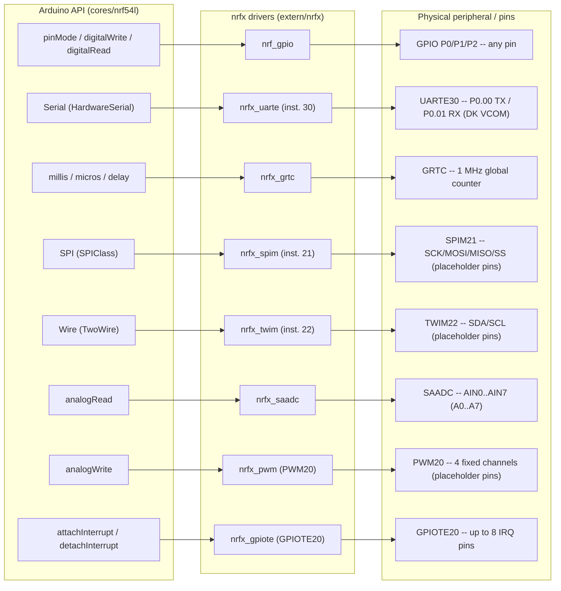

# arduino-nrf54 -- Developer Guide

[](https://github.com/saikumar-mandaji/arduino-nrf54/actions/workflows/ci.yml)
[](../LICENSE)


-blue)

An Arduino API core for Nordic's **nRF54L15** (Cortex-M33), built directly
on Nordic's `nrfx` HAL/driver layer and ARM's CMSIS-Core. This document is
the API/architecture reference; for the short pitch and quick-start
commands see the top-level [`README.md`](../README.md). For the precise,
line-by-line accounting of what has and hasn't been verified, see
[`VERIFICATION.md`](VERIFICATION.md) -- this guide summarizes that file
faithfully but does not replace it.

> **Read this before flashing anything:** several pin assignments in this
> core are disclosed as best-effort placeholders, not confirmed hardware
> facts. Where that's true, it's called out explicitly below and in
> [`variants/nrf54l15dk/pins_arduino.h`](../variants/nrf54l15dk/pins_arduino.h).
> This project does not round placeholder guesses up to "verified."

<p align="center">
  <br>
  <sub>Nordic nRF54L15-DK (PCA10156) -- the only board this core targets in v1. Image: Nordic Semiconductor.</sub>
</p>

---

## Table of contents

1. [Why this exists](#why-this-exists)
2. [Supported hardware](#supported-hardware)
3. [Architecture overview](#architecture-overview)
4. [Getting started](#getting-started)
5. [API reference](#api-reference)
6. [Example sketches](#example-sketches)
7. [Hardware bring-up status](#hardware-bring-up-status)
8. [How this compares to mature Arduino cores](#how-this-compares-to-mature-arduino-cores)
9. [Roadmap / known gaps](#roadmap--known-gaps)
10. [Contributing](#contributing)
11. [License](#license)

---

## Why this exists

Nordic's nRF54 series (Cortex-M33, TrustZone-M, an updated peripheral set
that replaces several familiar nRF52-era blocks -- GRTC instead of RTC,
shared "flexible serial peripheral" blocks instead of independent
UART/SPI/TWI instances) currently has first-class support only through
Nordic's Zephyr-based nRF Connect SDK. There is no Arduino core for it --
not from Arduino, not from Nordic, not as a well-known community project.
Adafruit's `Adafruit_nRF52_Arduino` covers the nRF52 family; nothing
equivalent exists yet for the nRF54L15.

This project is that missing core, built from scratch: register-correct
peripheral access via Nordic's own vendored `nrfx` drivers, wrapped in the
familiar Arduino API surface (`pinMode`, `Serial`, `SPI`, `Wire`,
`analogRead`, `analogWrite`, `attachInterrupt`) so existing Arduino
sketches and mental models carry over as directly as the underlying
silicon allows.

It is **not** an official Arduino, Nordic, or Adafruit project. It is a
single-target, early-stage core: one board, one chip variant, a
deliberately narrow v1-v4 feature set, and an explicit, continuously
updated account of what's actually been proven on real hardware versus
what still needs it (see [Hardware bring-up status](#hardware-bring-up-status)).

## Supported hardware

| | |
|---|---|
| **MCU** | Nordic nRF54L15 (Arm Cortex-M33, TrustZone-M capable) |
| **Board** | Nordic **nRF54L15-DK**, PCA10156, v1 scope only |
| **Image type** | Secure-only, single-image firmware -- no Non-Secure split (see [Architecture overview](#architecture-overview)) |
| **Flash / RAM budget observed** | ~7.5 KB flash for `Blink` (via `arduino-cli`'s size report), well inside the DK's 1.5 MB flash / 256 KB RAM |
| **Radio (BLE / 802.15.4)** | Not used by this core at all -- out of scope, see [Roadmap](#roadmap--known-gaps) |
| **Toolchain** | ARM GNU Toolchain (`arm-none-eabi-gcc`/`g++`/`objcopy`/`size`), or `arduino-cli`/Arduino IDE with this repo installed as a hardware package |
| **Flashing** | `nrfutil device program` (SWD, via the DK's onboard J-Link) -- confirmed working. Drag-and-drop MSD flashing does **not** work on the DK unit this was tested on (see [Hardware bring-up status](#hardware-bring-up-status)) |

Full parts list and wiring notes: [`hardware/BOM.md`](hardware/BOM.md).

## Architecture overview

Three architectural decisions shape everything else in this core; all
three are explained in depth in [`ARCHITECTURE.md`](ARCHITECTURE.md) and
only summarized here.

**Built on `nrfx`, not raw register access.** `extern/nrfx` (Nordic's
BSD-3-Clause standalone driver layer, the same code Zephyr/nRF Connect SDK
use internally) and `extern/CMSIS_6` (ARM's Cortex-M33 core headers) are
vendored as real git submodules. Register-level correctness -- EasyDMA
setup, timing, errata workarounds -- comes from Nordic's maintained code
rather than being reimplemented from the reference manual.

**Secure-only image, no TrustZone-M partitioning.** The nRF54L15 supports
splitting firmware into a Secure and a Non-Secure image via TrustZone-M.
This core deliberately runs as one Secure-only image with no SAU/IDAU
configuration and no Secure/Non-Secure boundary -- a scoping decision to
keep v1 buildable and verifiable, not an oversight. Revisiting this is a
known v2+ item (see [Roadmap](#roadmap--known-gaps)).

**One shared "flexible serial peripheral" block per index.** Unlike the
nRF52 series' independent UART/SPI/TWI peripherals, the nRF54L15 has
numbered "flexible serial peripheral" blocks (index 20, 21, 22, 30, ...)
that can each be configured as UARTE, SPIM, SPIS, TWIM, or TWIS -- but only
one role at a time per index. This is why `Serial`, `SPI`, and `Wire` in
this core are pinned to three genuinely separate indices (UARTE**30**,
SPIM**21**, TWIM**22**) rather than arbitrary free ones: picking two
peripherals that alias to the same hardware block would silently break
one of them. `PWM20` and `GPIOTE20`, by contrast, are dedicated hardware
with no such sharing constraint.



One notable build-system detail (full story in `ARCHITECTURE.md`):
`arduino-cli`'s core auto-discovery only compiles source files that live
physically inside `cores/nrf54l/`, but the real `nrfx` driver/startup
sources live in the vendored `extern/nrfx/` submodule. This core resolves
that with underscore-prefixed wrapper files (e.g.
`cores/nrf54l/_nrfx_uarte.c`) that are each a single `#include` of the
real vendored source -- a compilation-unit shim, not a code copy.

## Getting started

### 1. Clone with submodules

This repo vendors `nrfx` and `CMSIS_6` as real git submodules -- a plain
clone leaves `extern/` empty.

```sh
git clone --recurse-submodules https://github.com/saikumar-mandaji/arduino-nrf54
# or, if already cloned without --recurse-submodules:
git submodule update --init --recursive
```

### 2a. Build with the Makefile (fastest path for CI / local dev)

Requires `arm-none-eabi-gcc`/`g++`/`objcopy`/`size` on `PATH` (e.g. the
[ARM GNU Toolchain](https://developer.arm.com/downloads/-/arm-gnu-toolchain-downloads)).
This is the same build CI runs on every push.

```sh
make EXAMPLE=Blink
make EXAMPLE=SerialEcho
make EXAMPLE=I2CScanner
make EXAMPLE=SPILoopback
make EXAMPLE=AnalogReadSerial
make EXAMPLE=PWMFade
make EXAMPLE=ButtonInterrupt
```

### 2b. Build with the Arduino IDE / `arduino-cli`

Place (or symlink/junction) this repository at
`<sketchbook>/hardware/<vendor>/nrf54l/` so `arduino-cli`/the IDE picks up
`boards.txt`/`platform.txt`, then:

```sh
arduino-cli compile --fqbn <vendor>:nrf54l:nrf54l15dk examples/Blink
```

This path has been exercised directly (not just the Makefile) -- see
[Hardware bring-up status](#hardware-bring-up-status).

### 3. Flash

**Confirmed working:** `nrfutil device program` over SWD, via the DK's
onboard J-Link.

```sh
nrfutil device program --firmware path/to/firmware.hex --serial-number <SN>
nrfutil device reset --serial-number <SN> --reset-kind RESET_PIN
```

Install with `winget install NordicSemiconductor.nrfutil` then `nrfutil
install device`.

**Does not work on the DK unit tested:** drag-and-drop of the `.hex` onto
the DK's `JLINK` USB mass-storage drive. It produces a `FAIL.TXT` reading
"The currently active SWD interface does not support MSD drag and drop."
Try it if you like -- it's zero-install -- but treat `nrfutil` as the
primary method, not a fallback.

Full parts list: [`hardware/BOM.md`](hardware/BOM.md).

## API reference

The full public surface is `cores/nrf54l/Arduino.h`
(`pinMode`/`digitalWrite`/`digitalRead`/`analogRead`/`analogWrite`/
`attachInterrupt`/`detachInterrupt`/`millis`/`micros`/`delay`/
`delayMicroseconds`), plus the `Serial`, `SPI`, and `Wire` global objects
declared in their respective headers. Digital pin numbers `D0`-`D34` are a
simple linear map across the nRF54L15's three GPIO ports (P0: 7 pins, P1:
17 pins, P2: 11 pins -- 35 GPIOs total) -- **not** the DK's silkscreen
numbering. See `variants/nrf54l15dk/pins_arduino.h` for the full
`Dn -> Pport.pin` table.

### GPIO

```cpp
pinMode(pin, OUTPUT | INPUT | INPUT_PULLUP | INPUT_PULLDOWN);
digitalWrite(pin, HIGH | LOW);
int digitalRead(pin);
```

Built on `nrf_gpio` directly (`wiring_digital.c`). Works on any `Dn` pin.

| Symbol | Pin | Status |
|---|---|---|
| `LED_BUILTIN` | P2.09, **active-high** | Confirmed against Zephyr's `nrf54l15dk_common.dtsi`; visually confirmed blinking on real hardware |
| `BTN1` | P1.13 | Confirmed against Zephyr's devicetree (`button0`/`sw0`); **not yet physically pressed and confirmed** |

### Serial (UARTE30)

```cpp
Serial.begin(baudrate);
Serial.print(...) / Serial.println(...);   // via Print base class
Serial.write(uint8_t) / Serial.write(buf, len);
int Serial.available();
int Serial.read();
int Serial.peek();
```

`HardwareSerial` wraps **UARTE30**, on **P0.00 (TX) / P0.01 (RX)** --
confirmed to be the instance wired to the nRF54L15-DK's onboard J-Link
VCOM bridge (cross-checked against Zephyr's `nrf54l15dk_nrf54l15`
devicetree `uart30` node). `write()` is blocking
(`NRFX_UARTE_TX_BLOCKING`). `read()`/`available()` poll a single
re-armed one-byte RX buffer -- there is no interrupt-driven ring buffer
yet, so bytes arriving faster than the sketch calls `Serial.read()` can
be dropped (a known, disclosed limitation, not a bug).

**Status is a genuine, unresolved discrepancy, not a confirmed pass or
fail**: the user reported seeing live output on the DK's VCOM port via
Nordic's own nRF Connect for Desktop "Serial Terminal" app. Independent
automated verification (two different serial libraries, .NET
`SerialPort` and Python `pyserial`, tried against both enumerated VCOM
ports) read zero bytes under the same conditions. The firmware side is
confirmed healthy either way (`HardwareSerial::begin()` reports success,
read back live via SWD). See [Hardware bring-up
status](#hardware-bring-up-status) and `docs/VERIFICATION.md` for the
full account -- this needs to be resolved with a known-good terminal
tool run side-by-side with the automated read path before it can be
called either confirmed-working or confirmed-broken.

| Symbol | Pin | Status |
|---|---|---|
| `PIN_SERIAL_TX` | P0.00 | Confirmed (instance + pins) against Zephyr devicetree |
| `PIN_SERIAL_RX` | P0.01 | Confirmed (instance + pins) against Zephyr devicetree |

### Timing (GRTC)

```cpp
uint32_t millis();
uint32_t micros();
void delay(uint32_t ms);
void delayMicroseconds(uint32_t us);
```

Built on the nRF54 series' GRTC (Global Real-Time Counter), which
replaces the nRF52's RTC for this purpose. GRTC's syscounter runs at a
fixed 1 MHz (`NRF_GRTC_SYSCOUNTER_MAIN_FREQUENCY_HZ`), so `micros()` is
an unscaled read of `nrfx_grtc_syscounter_get()`. Confirmed working
end-to-end on real hardware via `Blink`'s LED blinking at the expected
rate; quantitative timing accuracy (e.g. whether 500 ms is really
500 ms) has not been scope/logic-analyzer measured.

### SPI (SPIM21)

```cpp
SPI.begin();
SPI.beginTransaction(SPISettings(clockHz, MSBFIRST_SPI, SPI_MODE0));
uint8_t SPI.transfer(uint8_t data);
void SPI.transfer(void *buf, size_t count);                 // in-place
void SPI.transfer(const void *tx, void *rx, size_t count);  // full-duplex
SPI.endTransaction();
```

Blocking transfers only, single fixed instance (SPIM21), no multi-device
transaction queuing. `beginTransaction()`/`endTransaction()` apply
`SPISettings` via `nrfx_spim_reconfigure()`.

| Symbol | Pin | Status |
|---|---|---|
| `PIN_SPI_SCK` | P1.10 (`D17`) | Best-effort placeholder -- unverified |
| `PIN_SPI_MOSI` | P1.11 (`D18`) | Best-effort placeholder -- unverified |
| `PIN_SPI_MISO` | P1.12 (`D19`) | Best-effort placeholder -- unverified |
| `PIN_SPI_SS` | P1.13 (`D20`) | Best-effort placeholder -- unverified |

### Wire / I2C (TWIM22)

```cpp
Wire.begin();
Wire.setClock(frequencyHz);
Wire.beginTransmission(address);
uint8_t Wire.endTransmission(bool sendStop = true);
size_t Wire.requestFrom(address, quantity, bool sendStop = true);
size_t Wire.write(uint8_t) / Wire.write(buf, len);
int Wire.available() / Wire.read() / Wire.peek();
```

Master mode only (no slave mode), blocking, fixed 32-byte TX/RX buffers
(`WIRE_BUFFER_LENGTH`) -- `write()` silently drops bytes past the limit
and `requestFrom()` silently truncates oversized requests rather than
erroring.

| Symbol | Pin | Status |
|---|---|---|
| `PIN_WIRE_SDA` | P1.14 (`D21`) | Best-effort placeholder -- unverified |
| `PIN_WIRE_SCL` | P1.15 (`D22`) | Best-effort placeholder -- unverified |

### analogRead (SAADC)

```cpp
int analogRead(uint32_t channel);  // A0..A7, 12-bit result (0-4095)
```

`A0`-`A7` are **SAADC channel indices**, not GPIO pin numbers -- the
nRF54L15's SAADC selects inputs via `NRFX_ANALOG_EXTERNAL_AIN0..AIN13`
rather than a fixed GPIO pin mapping. Single-ended, 12-bit, blocking
(`NULL` event handler, same pattern as UARTE/SPIM/TWIM). Which physical
GPIO pin each `AINn` corresponds to is fixed in silicon; that mapping is
disclosed as unverified against the DK -- see `pins_arduino.h`.

### analogWrite (PWM20)

```cpp
void analogWrite(uint32_t pin, uint8_t value);  // pin: PIN_PWM0..PIN_PWM3 only, value 0-255
```

Built on PWM20 -- a dedicated peripheral independent of the shared
UARTE/SPIM/TWIM blocks, with exactly 4 output channels
(`NRF_PWM_LOAD_INDIVIDUAL` mode, each channel an independent duty cycle
in one continuously looping sequence). `analogWrite()` only works on
those 4 fixed pins -- a real hardware limit (PWM20 has 4 channels), not
an oversight.

| Symbol | Pin | Status |
|---|---|---|
| `PIN_PWM0` | P1.16 (`D23`) | Best-effort placeholder -- unverified |
| `PIN_PWM1` | P2.00 (`D24`) | Best-effort placeholder -- unverified |
| `PIN_PWM2` | P2.01 (`D25`) | Best-effort placeholder -- unverified |
| `PIN_PWM3` | P2.02 (`D26`) | Best-effort placeholder -- unverified |

### attachInterrupt / detachInterrupt (GPIOTE20)

```cpp
void attachInterrupt(uint32_t pin, void (*callback)(void), int mode);  // RISING, FALLING, or CHANGE
void detachInterrupt(uint32_t pin);
```

Built on GPIOTE20, genuinely independent hardware from PWM20 and the
shared serial blocks. Up to **8 simultaneous** interrupt pins
(`NRFX_GPIOTE_CONFIG_NUM_OF_EVT_HANDLERS`, raised from nrfx's default of
2). A single shared dispatch function looks up the firing pin in a small
fixed table rather than allocating a distinct handler per pin.

**Edge triggers only** (`RISING`/`FALLING`/`CHANGE`) -- level triggers
(`LOW`/`HIGH`) are not supported. This is a real nrfx/hardware
constraint: `nrfx_gpiote_input_configure()` treats combining a level
trigger with a GPIOTE channel (which `attachInterrupt()` always
requests) as an invalid configuration.

## Example sketches

All 7 examples build and link cleanly through both the Makefile and
`arduino-cli` (regression-checked together as of the latest v4 change --
see `VERIFICATION.md`). Hardware-tested status is summarized in the table
and detailed in [Hardware bring-up status](#hardware-bring-up-status).

| Sketch | Demonstrates | Hardware-tested? |
|---|---|---|
| [`Blink`](../examples/Blink/Blink.ino) | `pinMode`/`digitalWrite` + GRTC `delay()`, blinking `LED_BUILTIN` with a compile-time active-high/active-low switch | **Yes** -- LED visibly blinks at ~1 Hz on a real DK |
| [`SerialEcho`](../examples/SerialEcho/SerialEcho.ino) | `Serial.available()`/`read()`/`write()` round-trip -- echoes every received byte back | Flashed to real hardware; TX/RX confirmed not to have crashed the firmware, but no byte has been confirmed observed on the VCOM port yet |
| [`I2CScanner`](../examples/I2CScanner/I2CScanner.ino) | `Wire.beginTransmission()`/`endTransmission()` swept across all 7-bit addresses (0x08-0x77) to find ACKing devices | No -- builds only, never run against a real I2C bus |
| [`SPILoopback`](../examples/SPILoopback/SPILoopback.ino) | `SPI.beginTransaction()`/`transfer()` -- sends all 256 byte values and checks they read back unchanged (requires a MOSI-to-MISO jumper) | No -- builds only, never run with a real jumper |
| [`AnalogReadSerial`](../examples/AnalogReadSerial/AnalogReadSerial.ino) | `analogRead(A0)`, prints the 12-bit SAADC result every 500 ms | No -- builds only, never seen a real analog signal |
| [`PWMFade`](../examples/PWMFade/PWMFade.ino) | `analogWrite(PIN_PWM0, ...)` ramped 0->255->0 to fade an LED | No -- builds only, never seen a scope trace or real LED |
| [`ButtonInterrupt`](../examples/ButtonInterrupt/ButtonInterrupt.ino) | `attachInterrupt(BTN1, ..., FALLING)` toggling `LED_BUILTIN` state from an ISR | No -- builds only, never had a real button press |

## Hardware bring-up status

This section is a condensed summary. For full detail, exact fault
register values, and the reasoning behind each fix, read
[`VERIFICATION.md`](VERIFICATION.md) directly -- do not treat this table
as a substitute for it.

A real nRF54L15-DK (PCA10156) has been connected and used for genuine
hardware bring-up: flashing via `nrfutil device program` over SWD, and
debugging by halting the CPU and reading live registers/memory, not just
"flash and hope."

**Confirmed on real silicon:**
- Firmware boots and runs correctly (confirmed by halting the CPU and
  reading the PC inside real application code).
- `pinMode()`/`digitalWrite()`/GRTC-based `delay()` all work end-to-end --
  `Blink`'s LED visibly blinks at the correct rate.
- `nrfutil device program` flashing works reliably; drag-and-drop MSD
  flashing does not on this DK/interface-firmware combination.
- `LED_BUILTIN` (P2.09, active-high) and `BTN1` (P1.13) pin assignments,
  corrected against Zephyr's real devicetree.

**Two real bugs found and fixed via SWD debugging** (neither was
catchable by compile-time checking alone):
1. `Serial` was originally on `NRF_UARTE20`, which is not connected to
   anything outside the chip on this board -- fixed by switching to
   `NRF_UARTE30`/P0.00/P0.01, the instance actually wired to the DK's
   VCOM bridge.
2. `nrfx_grtc_syscounter_start(true, NULL)` crashed with a HardFault --
   nrfx's `channel_allocate()` writes through its output-channel pointer
   unconditionally despite the header implying it's optional. Fixed by
   passing a real `static uint8_t` instead of `NULL`.

**Still not verified as of the latest `VERIFICATION.md`:**
- `Serial` has not produced confirmed byte output on the DK's VCOM port
  even after the UARTE30 fix -- likely needs Nordic's Board Configurator
  tool to enable UART bridging, not a firmware fix.
- `micros()`/`delay()` timing accuracy has not been measured
  quantitatively (only "visually roughly correct").
- `BTN1` has been cross-checked against the devicetree but not physically
  pressed.
- All SPI/Wire/analogRead/PWM/attachInterrupt pin assignments remain
  unconfirmed placeholders, and none of `SPILoopback`, `I2CScanner`,
  `AnalogReadSerial`, `PWMFade`, or `ButtonInterrupt` have been flashed
  and run against real peripherals or signals.

Check `VERIFICATION.md` directly before relying on any status above --
hardware bring-up may be actively progressing in parallel with any given
reading of this guide.

## How this compares to mature Arduino cores

This project is v1-v4 of a single-board core built from scratch this
year, not a multi-year community effort. For context, here's an honest
comparison against two mature, widely-used Arduino cores in the same
space:

| | **arduino-nrf54** (this project) | [Adafruit `Adafruit_nRF52_Arduino`](https://github.com/adafruit/Adafruit_nRF52_Arduino) | [`espressif/arduino-esp32`](https://github.com/espressif/arduino-esp32) |
|---|---|---|---|
| Target chip family | nRF54L15 only | nRF52832/52833/52840 | ESP32/S2/S3/C3/C6/H2/P4 and more |
| Boards supported | 1 (nRF54L15-DK) | Many (Feather nRF52, Circuit Playground, ItsyBitsy, etc.) | Dozens |
| GPIO | Yes | Yes | Yes |
| Serial/UART | Yes (1 instance, blocking TX, polled single-byte RX) | Yes (multiple, buffered) | Yes (multiple, buffered) |
| SPI | Yes (1 instance, blocking) | Yes (multiple, incl. DMA) | Yes (multiple, incl. DMA) |
| I2C (Wire) | Yes (master only, 32-byte buffers) | Yes (master + slave) | Yes (master + slave) |
| analogRead | Yes (8 channels, blocking) | Yes | Yes |
| analogWrite/PWM | Yes (4 fixed channels) | Yes | Yes (many channels, LEDC) |
| attachInterrupt | Yes (edge-only, 8 pins) | Yes (edge + level) | Yes (edge + level) |
| BLE / 802.15.4 radio | **No** | Yes (Bluefruit BLE stack) | Yes (WiFi + BLE) |
| RTOS integration | No | Yes (FreeRTOS-based) | Yes (FreeRTOS-based) |
| OTA/DFU | **No** | Yes | Yes |
| Low-power sleep modes | **No** | Yes | Yes |
| TrustZone-M / Secure-Non-Secure split | **No** (secure-only image) | N/A (nRF52 has no TrustZone-M) | N/A |
| Package managers (Boards Manager index, PlatformIO) | **No** (manual install only) | Yes | Yes |
| Community size / maturity | New, single-maintainer, private | Established, widely deployed | Established, widely deployed, Espressif-backed |

The honest takeaway: this core proves the same *category* of things those
projects do (GPIO, serial, SPI, I2C, ADC, PWM, interrupts, all on real
silicon) for a chip that had zero Arduino support, but at a fraction of
the scope, on one board, without radio/RTOS/OTA/power-management, and
without the years of field-testing those projects have behind them.

## Roadmap / known gaps

Deliberately out of scope for v1-v4 (see `ARCHITECTURE.md` for the
reasoning behind each):

- I2C/SPI slave modes, I2C multi-master arbitration
- Level-triggered (`LOW`/`HIGH`) pin interrupts -- a real nrfx/hardware
  constraint when combined with GPIOTE channel-based edge triggering, not
  an omission
- Non-Secure/TrustZone-M partitioning (Secure-only image only)
- Low-power sleep modes
- OTA/DFU
- The nRF54L15's radio (BLE, 802.15.4) entirely

Near-term, pre-"go public" priorities (see `README.md`'s status line and
`VERIFICATION.md`'s "What is NOT verified" section for the live list):
confirming `Serial` byte-level RX/TX on the DK's VCOM port, hardware
verification of SPI/Wire/analogRead/PWM/attachInterrupt against real
signals, and correcting any pin placeholders that turn out wrong the same
way the original `LED_BUILTIN`/`BTN1`/`Serial` guesses were.

## Contributing

This repository is currently private and undergoing its initial hardware
bring-up pass; it will go public once the remaining examples are
confirmed on real hardware (see `README.md`). Until then, treat
`VERIFICATION.md` as the single source of truth for what's safe to rely
on, and prefer opening pin-mapping corrections against Nordic's official
nRF54L15-DK Hardware User Guide / schematic over assuming any placeholder
in `pins_arduino.h` is correct.

## License

MIT for the code in this repository (see [`LICENSE`](../LICENSE)). The
`extern/nrfx` and `extern/CMSIS_6` submodules carry their own licenses
(BSD-3-Clause and Apache-2.0 respectively).
